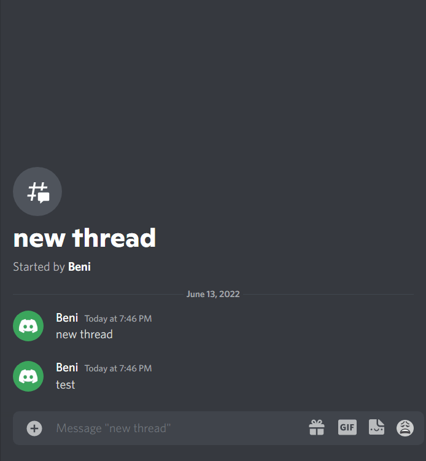

# Twit Fixer Discord Bot

## Description

If twitter.com link is posted without other content, deletes the message and re-posts it as vxtwitter.com link, mentioning the original poster.

## Set-up

* Copy `config.sample.json` to `config.json` and provide the bot's token.
* Bot must have the following:
  * Scopes
    * `bot`
  * Permissions
    * Read Messages/View Channels
    * Send Messages
    * Send Messages in Threads
    * Manage Messages

## Usage

Start with `node index.js`

## Example

